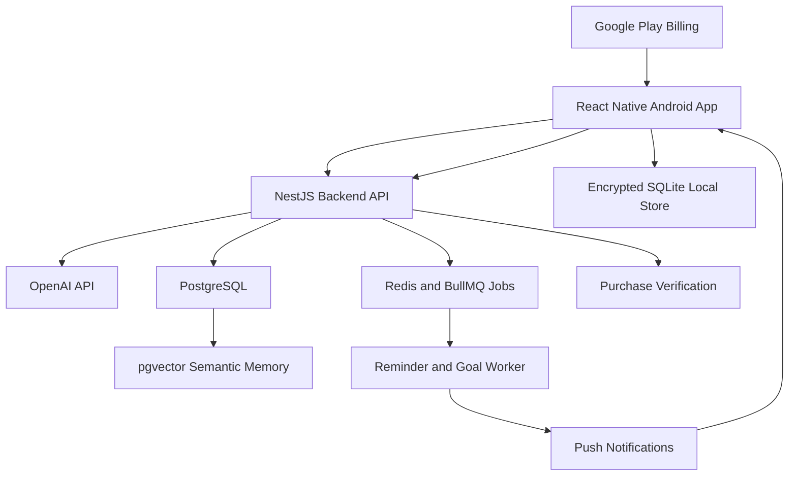

# Personal Assistant Architecture

## Product Direction

The app is an Android-first personal assistant built around chat, tasks, notes,
goals, reminders, and proactive help. Chat is only one input surface: the core
system stores structured user data and lets AI propose or perform structured
actions such as creating a task, scheduling a reminder, summarizing notes, or
suggesting the next step toward a goal.

## Stack

- Mobile: React Native, Expo development builds, TypeScript, Expo Router.
- Backend: NestJS, TypeScript, PostgreSQL, Prisma, Redis/BullMQ later for jobs.
- Shared contracts: Zod schemas in `packages/shared`.
- AI: OpenAI API through the backend only. The mobile app never stores provider
  API keys.
- Cloud memory: PostgreSQL plus `pgvector` embeddings.
- Local-private mode: encrypted SQLite on the device, with local vector search
  considered after the cloud MVP is stable.
- Payments: Google Play Billing subscriptions verified by the backend.
- Notifications: local notifications for exact user reminders, push
  notifications for server-generated nudges, and background tasks only for
  deferrable sync.

## System Diagram

## Data Ownership

The backend owns cloud data, AI orchestration, billing entitlement, usage limits,
and push scheduling. The mobile app owns user interface, local draft state,
local notifications, and the private local store. Shared schemas define the
shape of tasks, notes, reminders, goals, memory items, chat messages, assistant
actions, and subscription plans.

## Privacy Modes

Cloud AI mode stores user data on the backend and gives the best assistant
experience: memory search, cross-device sync, proactive reminders, and richer
goal support.

Local-private mode stores sensitive user data in encrypted SQLite. Backend data
is limited to account, subscription, and anonymous usage metadata. AI features
must either be disabled for private data or ask the user to approve the exact
context sent to OpenAI.

## Main Constraints

Android background execution is not reliable enough to promise that the app can
"wake itself" at any moment. Exact reminders should use scheduled local
notifications. Proactive assistant nudges should use server-side scheduling and
push notifications. Background tasks should be treated as opportunistic sync.

OpenAI usage has variable cost. The backend must enforce quotas and track cost
per user from the first release.

Google Play release requires billing disclosure, privacy policy, data safety
answers, account deletion, subscription cancellation access, and careful
handling of personal data.
