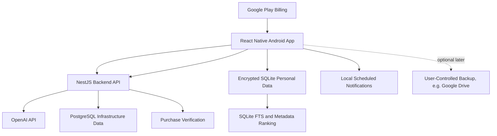

# Personal Assistant Architecture

## Product Direction

The app is an Android-first personal assistant built around four mobile tabs:
Chat, Tasks, Reminders, and Settings. Chat is the main input surface, but the
core product value is structured local data. Tasks are larger outcomes, not
quick todos. Each Task can contain many Subitems, related Documents, and simple
time-based Reminders that help the user know what comes next.

PA can propose creating, editing, viewing, and completing Tasks and Subitems,
attaching or summarizing task Documents, and scheduling Reminders. The user
remains in control of saved changes through confirmation and undo flows.

## Stack

- Mobile: React Native, Expo development builds, TypeScript, Expo Router.
- Backend: NestJS, TypeScript, PostgreSQL, Prisma. Redis/BullMQ can be added later
  for infrastructure jobs, not for MVP personal reminders.
- Shared contracts: Zod schemas in `packages/shared`.
- AI: OpenAI API through the backend only. The mobile app never stores provider
  API keys.
- Local data: encrypted SQLite on the device is the source of truth for personal
  assistant data.
- Local context retrieval: SQLite tables plus full-text search and metadata ranking
  for MVP. Native local vector search can be evaluated later.
- Backend database: PostgreSQL for infrastructure data only: user identity mapping,
  subscriptions, usage counters, purchase verification, rate limits, and
  non-sensitive operational records.
- Payments: Google Play Billing subscriptions verified by the backend.
- Notifications: local scheduled notifications for MVP reminders. Push
  notifications and server-generated nudges are deferred.

## System Diagram

## Data Ownership

The mobile app owns personal data: Tasks, Subitems, Documents, Reminders,
memory, conversation history, local notifications, and the local context index.
The backend owns AI proxying, billing entitlement, usage limits, purchase
verification, rate limiting, and non-sensitive operational records. Shared
schemas define the shape of Tasks, Subitems, Documents, Reminders, memory
items, chat messages, assistant actions, and subscription plans.

## Privacy Modes

The MVP is local-first. Personal data is stored on-device by default and should
not be stored in the backend database. When the assistant needs AI, the mobile
app builds a small context packet locally and sends only the required context
through the backend to OpenAI.

Optional backup or sync can use user-controlled storage such as Google Drive
later. Any future cloud assistant features should be opt-in and clearly explain
what data leaves the device.

## Local Context Strategy

The MVP should not depend on a local vector database. Android can support local
vector search through native libraries or SQLite extensions, but that adds native
build, encryption, packaging, and model/embedding complexity. It is better to
start with deterministic local retrieval:

- Store Tasks, Subitems, Documents, Reminders, memory items, and chat summaries in
  encrypted SQLite.
- Maintain searchable text columns or SQLite FTS tables for task titles,
  subitem titles, document names/snippets, reminder text, memory, and
  conversation summaries.
- Rank candidate context by direct text match, recency, importance, due date,
  incomplete status, and explicit user pins/favorites.
- Summarize older conversations locally into compact memory records before
  sending context to the AI.
- Send a bounded context packet to the backend for each AI request; do not send
  the full local database.

Local vector search can be revisited when FTS and metadata ranking are not good
enough. Possible future options include a native SQLite vector extension, a
mobile database with vector indexing, or local embeddings generated on-device.

## Main Constraints

Android background execution is not reliable enough to promise that the app can
"wake itself" at any moment. Exact reminders should use scheduled local
notifications. Proactive assistant nudges should wait until push infrastructure
and clear user consent exist. Background tasks should be treated as
opportunistic maintenance.

OpenAI usage has variable cost. The backend must enforce quotas and track cost
per user from the first release, while avoiding storage of personal message
content.

Google Play release requires billing disclosure, privacy policy, data safety
answers, account deletion, subscription cancellation access, and careful
handling of personal data.

## MVP Navigation

The mobile tab bar is fixed for MVP:

- Chat: natural-language assistant input, replies, and proposal review.
- Tasks: outcome-oriented work containers with Subitems and Documents.
- Reminders: simple scheduled prompts tied to a Task or Subitem.
- Settings: account, subscription, privacy, export/delete, and AI data sharing.

Notes and Goals are not top-level MVP tabs. If needed, note-like references
belong to task Documents, and goal-like planning belongs inside Tasks until the
core loop proves demand for separate surfaces.
